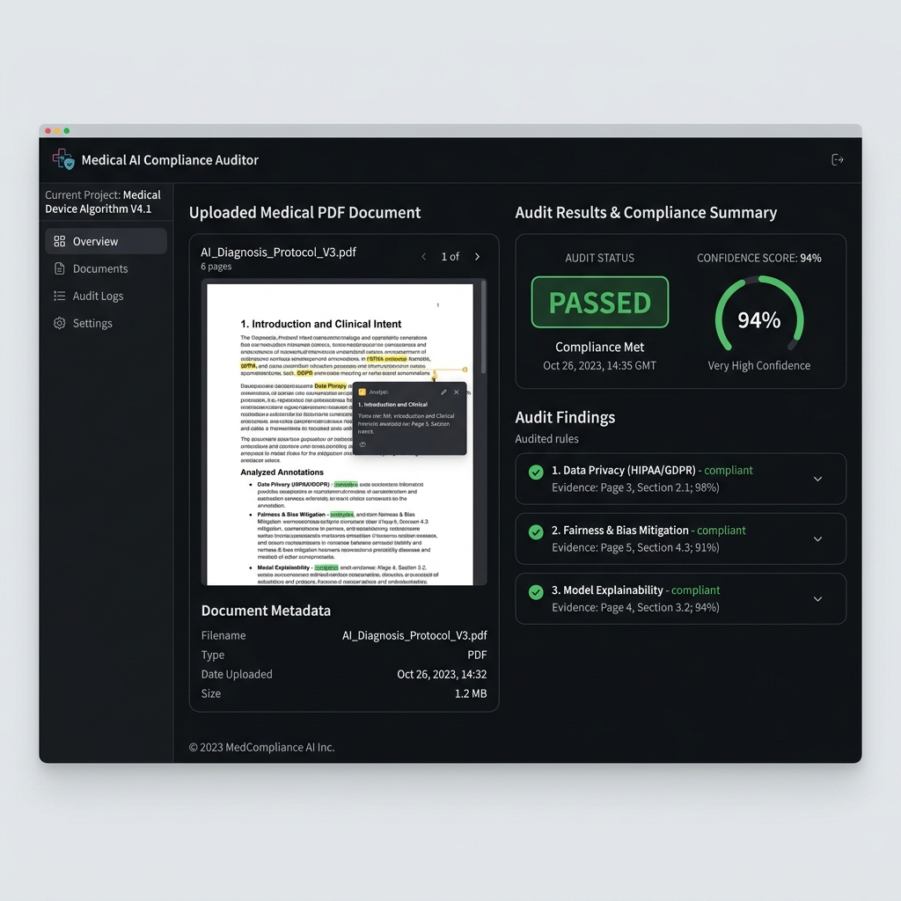
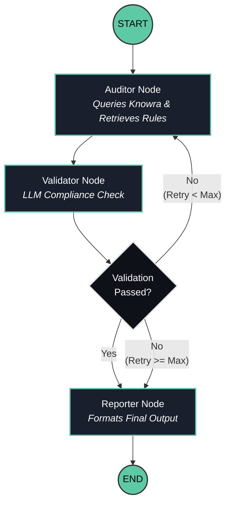

# 🛡️ Medic-Guard AI Auditor



Medic-Guard AI Auditor is an automated, AI-driven compliance auditing system for medical product documentation. It analyzes medical documents (like PDFs of product labels, clinical trial summaries, etc.) against FDA and EMA regulatory guidelines, flagging potential compliance issues and providing actionable remediation steps.

## ✨ Features

- **Automated Compliance Auditing:** Validates product documentation against ingested regulatory rules using advanced LLMs (OpenAI/Gemini).
- **Multi-Agent Workflow (LangGraph):** Uses a structured `StateGraph` containing Auditor, Validator, and Reporter nodes to robustly process and evaluate documents.
- **RAG-Powered Rules Engine (Knowra):** Ingests and retrieves relevant sections from FDA (e.g., 21 CFR 201 labeling, PII policy) and EMA guidelines using a ChromaDB vector store.
- **Confidence Scoring & Remediation:** Provides a confidence score for its evaluation and specific remediation suggestions if a document is flagged.
- **NeMo Guardrails Integration:** Ensures that LLM responses adhere to strict safety, PII, and formatting guidelines.
- **Modern User Interface:** Provides an easy-to-use Streamlit frontend for uploading PDFs and viewing audit results.
- **RESTful API Backend:** A scalable FastAPI backend endpoint to run the audit pipeline asynchronously.

## 🏗️ Architecture & Workflow

The application is composed of several key components:
1. **Frontend (Streamlit):** `medic_guard/app.py` allows users to upload PDF documents, extracts text using PyMuPDF (`fitz`), and queries the API.
2. **Backend API (FastAPI):** `medic_guard/api.py` exposes a POST endpoint `/audit` that triggers the LangGraph workflow.
3. **Audit Pipeline (LangGraph):** 
   - **Auditor Node:** Queries the `Knowra` knowledge base to retrieve specific regulatory rules matching the document.
   - **Validator Node:** Uses LLMs to evaluate the text against the rules. Includes self-reflection (CRAG fallback) to re-query if validation fails.
   - **Reporter Node:** Formats the final audit status (PASSED or FLAGGED), confidence score, rule references, and remediation steps.
4. **Knowledge Store (Knowra):** Manages vector embeddings of FDA/EMA documents (`knowra/ingestor.py`, `knowra/retriever.py`, `knowra/store.py`).
5. **Guardrails:** Uses NVIDIA NeMo Guardrails (`medic_guard/guardrails/`) to prevent PII leakage and ensure safe LLM interactions.

### 📊 LangGraph Execution Flow



## 🚀 Local Setup

### Prerequisites
- Python 3.9+
- Git
- OpenAI API Key or Google Gemini API Key

### Quick Start
```bash
# 1. Clone the repository
git clone https://github.com/Shashank-Jadhav9718/Medic-Guard-AI-Auditor.git
cd Medic-Guard-AI-Auditor

# 2. Create and activate a virtual environment
python -m venv .venv 
source .venv/bin/activate  # On Windows use: .venv\Scripts\activate

# 3. Install dependencies
pip install -r requirements.txt

# 4. Configure environment variables
cp .env.example .env   
# Edit .env and add your OPENAI_API_KEY / GEMINI_API_KEY

# 5. Ingest the regulatory documents into the Knowra vector store
python knowra/ingestor.py

# 6. Start the FastAPI backend server
uvicorn medic_guard.api:app --reload --port 8000 &

# 7. Start the Streamlit frontend UI
streamlit run medic_guard/app.py
```

## 📖 Standard Operating Procedure (SOP)

The Medic-Guard AI Auditor operates under the following SOP:
1. **Document Ingestion:** PDF documents are uploaded via the secure UI. Text is extracted, preserving essential content while ignoring formatting artifacts.
2. **Regulatory Retrieval:** The system identifies key medical entities and fetches relevant FDA/EMA clauses from the local vector database.
3. **Automated Audit:** The LLM-powered validation engine cross-references the document text with retrieved guidelines.
4. **Review & Remediation:** The system classifies the document as `PASSED` or `FLAGGED`. If flagged, explicit remediation instructions and the violated rule citations are provided to the user.
5. **Data Privacy:** PII and sensitive medical information are protected using NeMo guardrails before any LLM processing.
